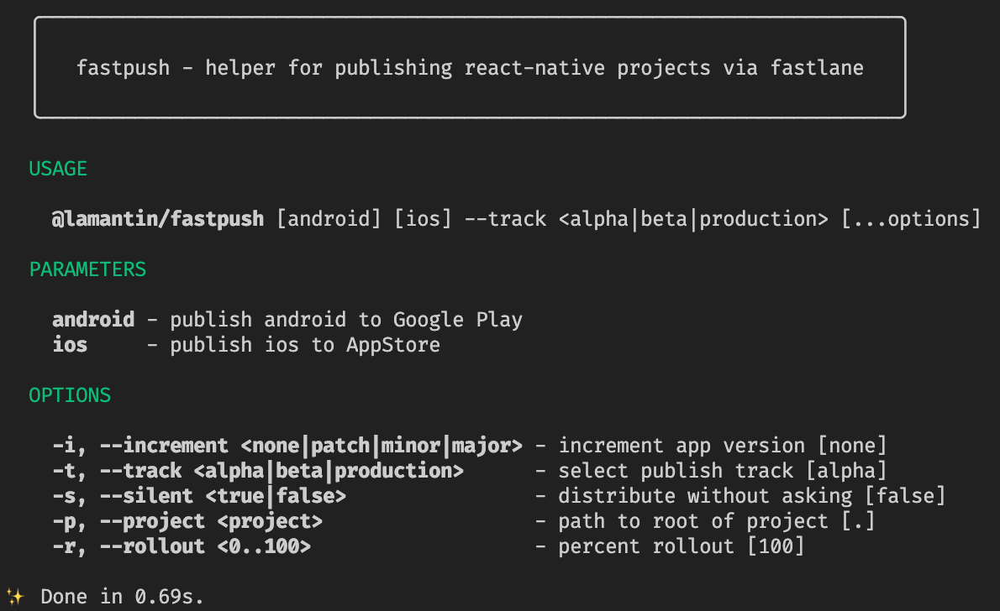

# fastpush [](https://codecov.io/gh/lamantin-group/publish) 

Painless publish React Native apps

### What is it
`fastpush` - it is frontend for [fastlane.tools](https://fastlane.tools/), that can offer to you next solved fastlane problems:

* Use plain JavaScript and TypeScript for build process
* Types and autocomplete for your actions and lanes
* Use single file for both platform without switching between them

### Usage

Write your own file that hold logic of build process

```ts
// my-own-publish-script.ts
import { android, gradle, AndroidPlatform, ui, supply, Incrementer } from "@lamantin/fastpush"

async function publish() {
  const androidPlatform = new AndroidPlatform()

  const [oldVersionCode, newVersionCode] = await androidPlatform.incrementVersionCode()
  ui.success(`Success update build [${oldVersionCode}] -> [${newVersionCode}]`)

  android([
    gradle("clean"),
    gradle("assemble", {
      build_type: "Release",
    }),
    supply({ track: "beta" }),
  ])
}

publish()
```

Run it via `ts-node my-own-publish-script.ts`

### Setup

1. Prepare environment needed for fastlane [iOS](https://docs.fastlane.tools/getting-started/ios/setup/) and/or [Android](https://docs.fastlane.tools/getting-started/ios/setup/) platforms
2. Install this `publish` library with preferred package manager\
`yarn add @lamantin/fastpush --dev`\
or\
`npm install @lamantin/fastpush --save-dev`
3. Go to [Usage](https://github.com/lamantin-group/publish#usage) and write your own build process

### Example

For more complicated examples of using this library, you can check implementation of CLI tool at [`src/cli/publish.ts`](https://github.com/lamantin-group/publish/blob/master/src/cli/publish.ts) that distributed with `@lamantin/fastpush`

You can run it via `yarn fastpush --help` for example


### Roadmap
- [ ] Typings to mostly used actions and lanes
- [ ] Use [semver](https://semver.org/) notation. \
For now, library api have experimental status and can be changed without semver version updates.
- [x] `IOSPlatform` helper for increment build number, set version name and getting this values
- [x] `AndroidPlatform` helper for increment build number, set version name and getting this values